# SpringBoot プロジェクトの作成

## 1. VSCode の拡張機能を入れる

1. Extension Pack for Java
2. Spring Boot Extension Pack

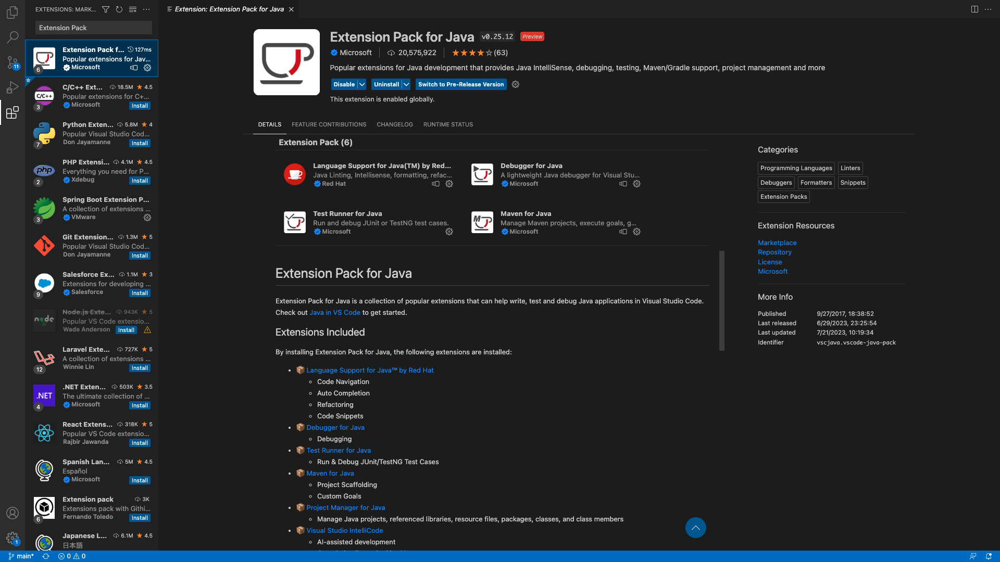 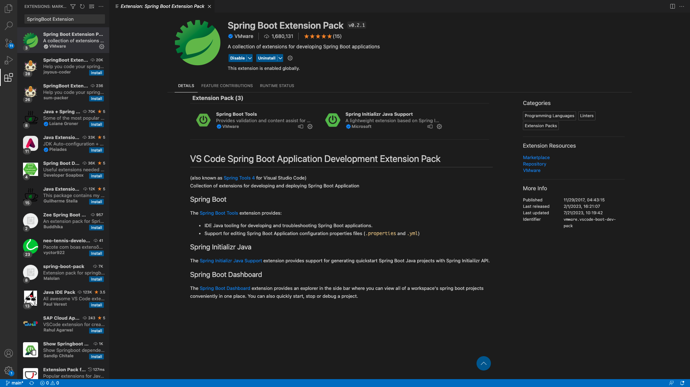

---

## 2. SpringBoot プロジェクトを作成する

### 2.1 Create Java Project をクリック

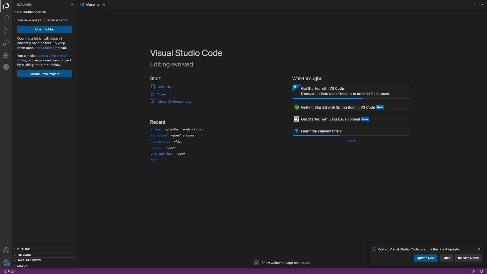

### 2.2 Spring Boot をクリック

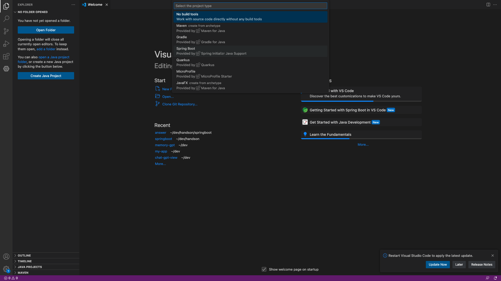

### 2.3 Maven Project をクリック

Maven も Gradle もパッケージ管理ツール。今回は maven を使う。
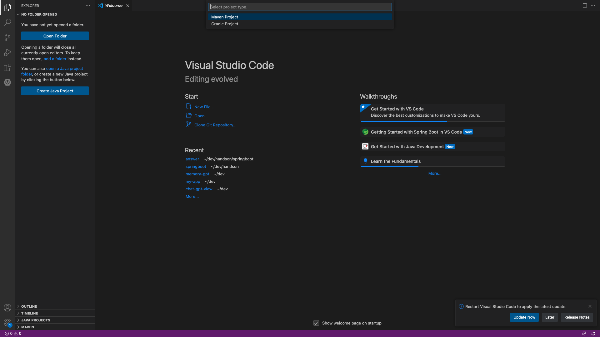

### 2.4 3.1.2 をクリック

SpringBoot のバージョンは 3.1.2 を使用する。
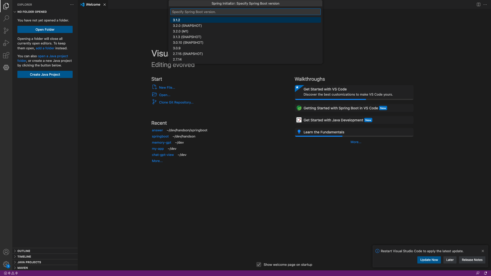

### 2.5 パッケージ名を入力する

Java はパッケージをディレクトリ構成で表現する。同一のパッケージ、同一のクラス名のクラスがあるとコンパイルできなくなるのでパッケージ名+クラス名は一意である必要がある。
なのでパッケージ名はよく自身の所属とかを書いたりする。

ここで指定したパッケージ名のディレクトリが作られる。

e.g.) `com.exmple`とした場合は`src/com/exmple`がこのプロジェクトのルートパッケージになる。
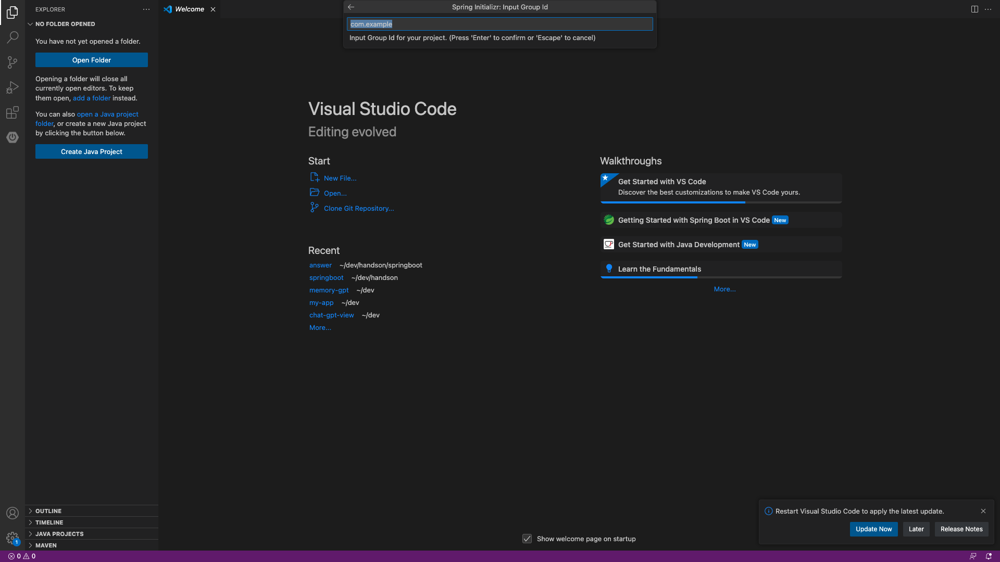

### 2.6 Project 名を設定する

ルートディレクトリやデフォルトのアプリの名前が指定した値になる。


### 2.7 ビルドターゲットを jar に指定する


|                      | JAR                                                           | WAR                                                                                 |
| -------------------- | ------------------------------------------------------------- | ----------------------------------------------------------------------------------- |
| 内容                 | Java クラス、メタデータ、リソース                             | HTML、JSP、Java クラス、ライブラリ、設定ファイルなどの Web アプリケーションリソース |
| 使い道               | アプリケーションの配布、ライブラリの共有                      | Web アプリケーションの配布                                                          |
| Web サーバー         | 組み込み（通常は Tomcat）                                     | 外部の Web コンテナ（Tomcat、Jetty など）が必要                                     |
| 自己完結型           | はい。Java Runtime Environment（JRE）があればどこでも実行可能 | いいえ。Web コンテナにデプロイする必要がある                                        |
| Spring Boot での利用 | 一般的。アプリケーションがサーバーを含むパッケージ            | あまり一般的ではないが、特定の環境では必要となる                                    |

### 2.8 Java のバージョン 17 に指定

LTS の 17 で
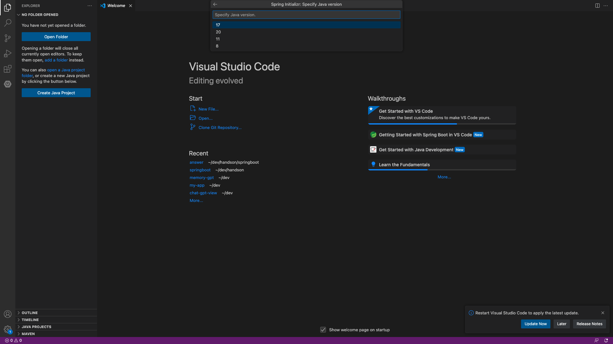

### 2.9 出力するディレクトリを選択

お好きな場所で

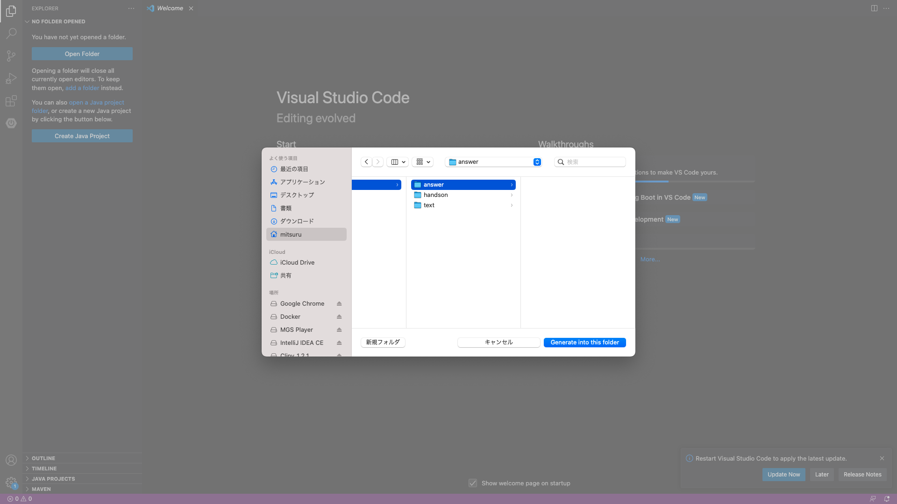

---

## 起動

1. /<指定したパッケージ>/<指定したアプリケーション名>/Application.java を開く
2. Run を押す
3. 以下のような起動ログが出れば OK
   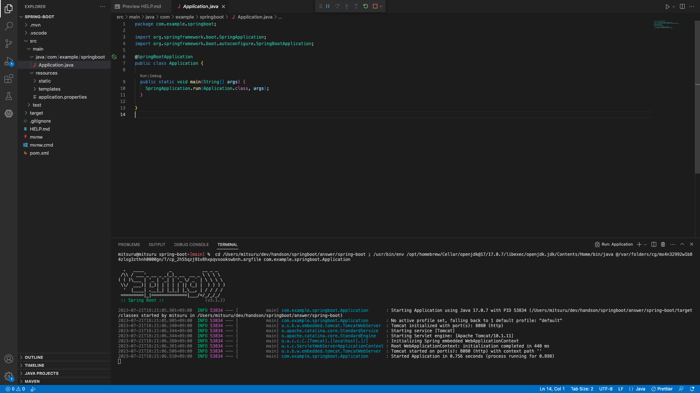

---

## 動作確認

これだけだとまだアプリケーションにアクセスできない。のでヘルスチェックパスを追加する。
ヘルスチェックパスとはアプリが動作しているかを確認するエンドポイントのこと。

1. pom.xml に以下を追加。

   maven は pom.xml でパッケージ情報を管理している。

   ```xml
   <dependencies>
     <dependency>
       <groupId>org.springframework.boot</groupId>
       <artifactId>spring-boot-starter-actuator</artifactId>
     </dependency>
   </dependencies>
   ```

2. 再起動する。

   起動したアプリケーションを止める。shell を閉じるか`Ctrl+C`で終了できる。
   終了したら再度`Run`を押す。

   ※ 画面中央上にあるリスタートボタンを押しただけでは再ビルドされない。

   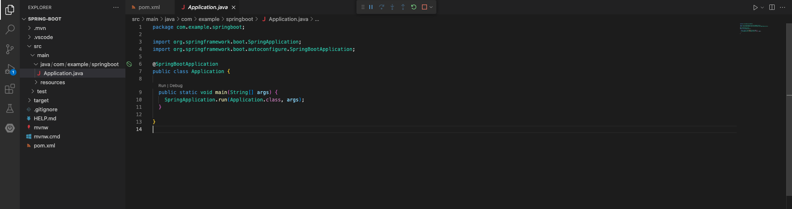

3. ブラウザからアクセスする。

   デフォルトでは 8080 ポートでホストしている。

   [http://localhost:8080/actuator/health](http://localhost:8080/actuator/health)

   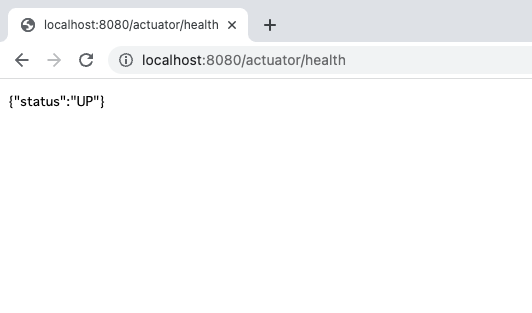
