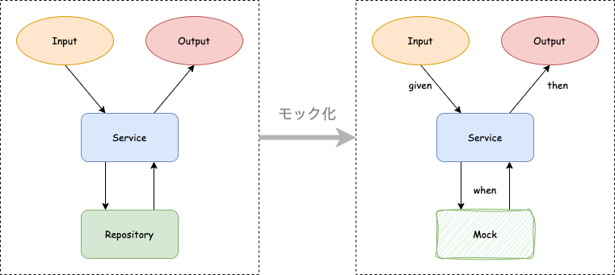

# 単体テスト について

単体テスト(ユニットテスト)とは一つのコンポーネントが予期した動作をすることを確認するテストとのこと。
単体テストで動作を確認することで変更した際に生じたバグを早期に発見し修正することができる。

## モック化

単体テストをする際には切り分けのために関連インスタンスをモック化する。<br>以下の図は Service をテストする場合のモック化。


## JUnit

Java の場合、`JUnit`というパッケージがよく使われる。以下にその書き方を示す。

単体テストと次章の結合テストについては PostgreSQL の場合のみ解説する。mongoDB の場合は[解答例](../../answer/mongodb/)を参照すること。

テストは対応するパッケージに置く。

- src/main/java/com/exmple/springboot/service/UserService.java
- src/test/java/com/exmple/springboot/service/UserServiceTest.java

テストは`given`,`when`,`then`を意識すると良い。

- **given**: テストの前提条件。入力値や mock の出力値、mock の動作などを定義する
- **when**: テスト対象のメソッドの実行
- **then**: 期待する結果を得られたか確認する

---

## Service の単体テスト

このように書く。

```java
package com.example.springboot.service;

import static org.mockito.ArgumentMatchers.any;
import static org.mockito.Mockito.doNothing;
import static org.mockito.Mockito.verify;
import static org.mockito.Mockito.when;

//...

import com.example.springboot.persistence.entity.User;
import com.example.springboot.persistence.mapper.UserMapper;

@SpringBootTest
public class UserServiceTest {

    @InjectMocks
    private UserService userService;

    @Mock
    private UserMapper userMapper;

    @Test
    void findById() {
        // given
        User user = User.builder().id(1).name("太郎").email("xxx@example.com").build();
        when(userMapper.findById(1)).thenReturn(user);
        // when
        User actual = userService.findById(1);
        // then
        assertThat(actual)
                .extracting(User::getId, User::getName, User::getEmail)
                .containsExactly(1, "太郎", "xxx@example.com");
    }

    @Test
    void insert() {
        // given
        doNothing().when(userMapper).insert(any(User.class));
        // when
        userService.insert(User.builder().name("太郎").email("xxx@example.com").build());
        // then
        verify(userMapper).insert(any(User.class));
    }

    @Test
    void deleteById() {
        // given
        doNothing().when(userMapper).deleteById(1);
        // when
        userService.deleteById(1);
        // then
        verify(userMapper).deleteById(1);
    }
}
```

いくつかアノテーションが増えたので解説する。

| アノテーション    | 説明                                                                                                       |
| ----------------- | ---------------------------------------------------------------------------------------------------------- |
| `@SpringBootTest` | SpringBoot アプリケーションのテストであることを明示。後続の`@InjectMocks`や`@Mock`を使うために必須。       |
| `@InjectMocks`    | テスト対象のコンポーネント                                                                                 |
| `@Mock`           | テスト対象のコンポーネントに DI するコンポーネントを mock 化する                                           |
| `@Test`           | JUnit にテストメソッドであることを認識させる。コンポーネント以外のテストでも使う。例えば Util クラスなど。 |

使用しているスタティックメソッドについて解説する。

スタティックとはインスタンスではなくクラスに紐づく領域のことでスタティックメソッドやスタティックフィールド（変数のこと）はインスタンスを生成することなく使える。クラスに紐づいているのでもちろん全てのインスタンスにとって共通のメソッドやフィールドになる。

| メソッド名                       | 使い道                                                                                                                                                    |
| -------------------------------- | --------------------------------------------------------------------------------------------------------------------------------------------------------- |
| org.mockito.Mockito.when         | モックしたコンポーネントで非 Void 型の関数が読み出された時の動作を定義する。                                                                              |
| org.mockito.ArgumentMatchers.any | 変数をマッチングするときに型をでマッチングを行う。when と組み合わせてある型の入力が来た場合の動作を定義する。派生系として anyInt(), anyString()などある。 |
| org.mockito.Mockito.doNothing    | モックしたコンポーネントで Void 型の関数が読み出された時の動作を定義する。when とは微妙に書き方が異なるので注意。                                         |
| org.mockito.Mockito.verify       | mock メソッドが呼び出されたかどうかを確認する。Void 型の関数の場合は出力値でテストできないので使う。                                                      |

---

## Controller の単体テスト

このように書く。

```java
package com.example.springboot.web.controller;

// ...
import static org.springframework.test.web.servlet.request.MockMvcRequestBuilders.*;
import static org.springframework.test.web.servlet.result.MockMvcResultMatchers.*;

// ...
import org.springframework.boot.test.autoconfigure.web.servlet.WebMvcTest;
import org.springframework.boot.test.mock.mockito.MockBean;
import org.springframework.test.web.servlet.MockMvc;

@WebMvcTest(UserController.class)
public class UserControllerTest {

    @Autowired
    MockMvc mockMvc;

    @Autowired
    private ObjectMapper mapper;

    @MockBean
    private UserService userService;

    @Test
    void findById() throws Exception {
        // given
        User user = User.builder().id(1).name("太郎").email("xxx@example.com").build();
        UserResponse expected = UserResponse.builder().id(1).name("太郎").email("xxx@example.com").build();
        when(userService.findById(1)).thenReturn(user);
        // when, then
        mockMvc.perform(get("/api/user/id/1"))
                .andExpect(status().isOk())
                .andExpect(content().json(mapper.writeValueAsString(expected)));
    }

    @Test
    void insert() throws Exception {
        // given
        Map<String, String> userRequestMap = new HashMap<>();
        userRequestMap.put("name", "太郎");
        userRequestMap.put("email", "xxx@example.com");
        doNothing().when(userService).insert(any(User.class));
        // when, then
        mockMvc.perform(put("/api/user")
                .contentType(MediaType.APPLICATION_JSON)
                .content(mapper.writeValueAsString(userRequestMap)))
                .andExpect(status().isCreated());
    }

    @Test
    void deleteById() throws Exception {
        // given
        doNothing().when(userService).deleteById(1);
        // when, then
        mockMvc.perform(delete("/api/user/1")
                .contentType(MediaType.APPLICATION_JSON))
                .andExpect(status().isNoContent());
    }
}

```

いくつかアノテーションが増えたので解説する。

| アノテーション | 説明                                                                  |
| -------------- | --------------------------------------------------------------------- |
| `@WebMvcTest`  | Controller の単体テストであることを示す。単体テスト対象を引数に取る。 |
| `@MockBean`    | Controller に DI するコンポーネントをモック化する。                   |

クラスについても解説する。

| クラス         | 説明                                                                                                                                                                                                                                                                                                                |
| -------------- | ------------------------------------------------------------------------------------------------------------------------------------------------------------------------------------------------------------------------------------------------------------------------------------------------------------------- |
| `MockMvc`      | SpringMVC を mock 化する。<br>SpringMVC とは Java ベースの Web アプリケーションフレームワークであり、tomcat を内蔵している。これのおかげで SpringBoot はウェブアプリケーションを簡単に構築できる。ブロッキング型のアーキテクチャであり、近年ではノンブロッキングの SpringWebFlux という別の選択肢も提供されている。 |
| `ObjectMapper` | 任意のクラス型から json 形式の String 型への変換、および逆変換ができる。Java ではんそれぞれ、シリアライズ、デシリアライズと呼ぶ。Controller の機能として Jackson というパッケージがシリアライズ、デシリアライズしている。テストでチェックするためにはテスト側でもシリアライズする必要があるため、使用する。         |

---

## 大事なこと

テストを書く目的はソフトウェアの品質や安定性を高め、継続的な開発を可能にするため。

個人で書いたプログラムに関して「1 年前に書いたコードが今でも動きますか？」と聞かれると多くの人はノーと答えると思う。しかしビジネスでは 3 年、5 年前のコードが当たり前のように要求される。それを実現するツールがテストである。具体的には以下の効果がある。

1. **品質保証**: バグや不具合の早期発見・修正を可能にし、ソフトウェアの品質を保証する。
2. **リファクタリング**: コードの構造や設計を安全に改善・最適化するためのサポート。
3. **ドキュメンテーション**: コードの動作や目的を明示的に示し、後の開発者にとってのガイドラインとなる。
4. **回帰テスト**: 既存の機能が新しい変更によって破壊されないことを確認する。
5. **開発の効率化**: 自動化されたテストにより、手動での確認作業を減少させ、開発のサイクルを高速化する。

またテストが書きやすいコードを突き詰めると自然とユニット間の結合が下がり、保守性の高いコードになる。
そのため単体テストをしっかり書くことが大事。

# 課題

1. Service のテストを実装せよ。
   1. テキスト中のテストを実装せよ。
   1. テキストにない`findAll()`と`update()`の単体テストを実装せよ
1. Controller の単体テストを実装せよ。
   1. テキスト中のテストを実装せよ。
   1. テキストにない`findAll()`と`update()`の単体テストを実装せよ
