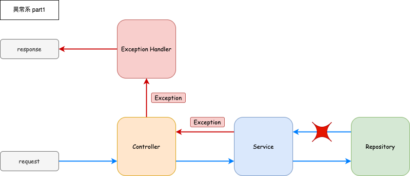

# ExceptionHandler について

ExceptionHandler Controller で特定の例外が発生した時のレスポンスを定義するクラスである。<br>
各コンポーネントで例外を処理せず、呼び出し元にスローするようにすることで以下のような動作をするアプリケーションを作ることができる。

### 正常系

正常系では ExceptionHandler は何もしない。これまでと同じ。


### 異常系

例外が発生した場合、そのコンポーネントから ExceptionHandler へと例外が伝播する。<br>
そして ExceptionHanlder が事前に定められたパターンに従ってエラーをレスポンスする。




このようなアーキテクチャにすることでアプリケーション全体としてアーリーリターンが実現され、各コンポーネントのロジックがシンプルになる。

---

## ExceptionHandler の実装

以下の手順で実装する。

1. Exception クラスを実装する。
1. Exception を throw するように実装を修正する。
1. ExceptionHandler を実装し、Exception クラスとエラーレスポンスの対応を明記する
1. テストの修正を行う。

---

### Exception クラスの実装

例えばこんな感じ。<br>
Exception の実装はプロジェクトの方針による。どのようにエラーを管理したいかで実装が変わる。

```java
package com.example.springboot.exception.exceptions;

import lombok.Getter;

@Getter
public class NotFoundException extends IOException {
    private final String detail;

    public NotFoundException(String message) {
        super(message);
        this.detail = "%s.%s()".formatted(
                Thread.currentThread().getStackTrace()[2].getClassName(),
                Thread.currentThread().getStackTrace()[2].getMethodName());
    }
}
```

特に解説することはないが、必ず Exception かその子クラスを継承すること。

```java
public class NotFoundException extends IOException
```

---

### Exception を throw するように実装を修正

例えば UserService の findById でエンティティが見つからなかった場合、例外をスローするようにする。

```java
@Service
public class UserService {
    // ...
    public User findById(Integer id) throws NotFoundException {
        User user = userMapper.findById(id);
        if (user == null) {
            throw new NotFoundException("IDが %s のユーザーは存在しません。".formatted(id));
        }
        return user;
    }
    // ...
}
```

findById が例外を吐くようになったので Controller の修正も必要。キャッチしないので`throws NotFoundException`を追加するだけ。

```java
@RestController
@RequestMapping("/api/user")
public class UserController {
    // ...
    @GetMapping("/id/{id}")
    public UserResponse findById(HttpServletResponse httpServletResponse, @PathVariable Integer id)
            throws NotFoundException {
        User user = userService.findById(id);
        return UserResponse.builder()
                .id(user.getId())
                .name(user.getName())
                .email(user.getEmail())
                .build();
    }
    // ...
}

```

---

### ExceptionHandler を実装する

先に ExceptionHandler が返す Response を実装する。

```java
package com.example.springboot.web.response;

// ...

@Getter
@Builder
public class ErrorResponse {
    private String message;
}
```

次に ExceptionHanlder を実装する。

```java
package com.example.springboot.exception;

// ...

import com.example.springboot.exception.exceptions.NotFoundException;
import com.example.springboot.web.response.ErrorResponse;

@RestControllerAdvice
public class GlobalExceptionHandler {

    @ExceptionHandler
    @ResponseStatus(HttpStatus.NOT_FOUND)
    public ErrorResponse handleNotFoundException(NotFoundException e) {
        return ErrorResponse.builder()
                .message(e.getMessage())
                .build();
    }
}
```

新しいアノテーションが増えたので説明する。

| アノテーション          | 説明                                                                                                    |
| ----------------------- | ------------------------------------------------------------------------------------------------------- |
| `@ExceptionHandler`     | Exception をハンドリングしレスポンスを生成するメソッドにつけるアノテーション                            |
| `@RestControllerAdvice` | `@ExceptionHandler`と合わせて全ての Controller に適応させる                                             |
| `@ResponseStatus`       | 200 以外のレスポンスステータスを返すときに使う。もっと細かく設定したい場合は`HttpServletResponse`を使う |

---

### テストの修正

1. Service の単体テストの修正。
   例外がスローされるか確認するテストを追加する。

   ```java
   @SpringBootTest
   class UserServiceTest {

       // ...

       @Nested
       class findById {
           @Test
           void ok() throws NotFoundException {
               // given
               User user = User.builder().id(1).name("太郎").email("xxx@example.com").build();
               when(userMapper.findById(1)).thenReturn(user);
               // when
               User actual = userService.findById(1);
               // then
               assertThat(actual)
                       .extracting(User::getId, User::getName, User::getEmail)
                       .containsExactly(1, "太郎", "xxx@example.com");
           }

           @Test
           void ng() {
               // given
               when(userMapper.findById(99)).thenReturn(null);
               // when, then
               assertThrows(NotFoundException.class, () -> userService.findById(99));
           }
       }
   }
   ```

   Exception が実際にスローされたかの確認は`assertThrows`を使う。

1. Controller の単体テストの修正
   Service でスローされた例外がキャッチされないか確認するテストを追加する。<br>
   `@WebMvcTest`アノテーションをつけている場合は自動で`@RestControllerAdvice`が DI されている。

   ```java
   @WebMvcTest(UserController.class)
   class UserControllerTest {

       // ...

       @Nested
       class findById {
           @Test
           void ok() throws Exception {
               // given
               User user = User.builder().id(1).name("太郎").email("xxx@example.com").build();
               UserResponse expected = UserResponse.builder().id(1).name("太郎").email("xxx@example.com")
                       .build();
               when(userService.findById(1)).thenReturn(user);
               // when, then
               mockMvc.perform(get("/api/user/id/1"))
                       .andExpect(status().isOk())
                       .andExpect(content().json(mapper.writeValueAsString(expected)));
           }

           @Test
           void ng() throws Exception {
               // given
               ErrorResponse expected = ErrorResponse.builder().message("not found").build();
               when(userService.findById(99)).thenThrow(new NotFoundException("not found"));
               // when, then
               mockMvc.perform(get("/api/user/id/99"))
                       .andExpect(status().isNotFound())
                       .andExpect(content().json(mapper.writeValueAsString(expected)));
           }
       }

       // ...
   }
   ```

1. 結合テストの修正

   エラーケースを追加する。

   ```java
   // ...
   @SpringBootTest(classes = Application.class, webEnvironment = SpringBootTest.WebEnvironment.RANDOM_PORT)
   @TestClassOrder(ClassOrderer.OrderAnnotation.class)
   @TestInstance(TestInstance.Lifecycle.PER_CLASS)
   @TestExecutionListeners(listeners = { FlywayTestExecutionListener.class }, mergeMode = MergeMode.MERGE_WITH_DEFAULTS)
   class UserApiTest {

       // ...

       @Nested
       @Order(1)
       class FindById {

           // ...

           @Test
           void 存在しないレコード() throws JsonProcessingException {
               // when
               ResponseEntity<String> responseEntity = restTemplate.exchange("/api/user/id/99", HttpMethod.GET,
                       new HttpEntity<>(httpHeaders), String.class);
               // then
               Map<String, String> body = mapper.readValue(responseEntity.getBody(), new TypeReference<>() {
               });
               assertThat(responseEntity.getStatusCode().value()).isEqualTo(404);
               assertThat(body.get("message")).isEqualTo("IDが 99 のユーザーは存在しません。");
           }
       }
   }
   ```

レスポンスクラスは`@Getter`と`@Builder`しか記載してないので Jackson がデシリアライズに失敗することがある。Map や List を使って JSON をパースするか、レスポンスクラスに`@AllArgsConstructor`か `@NoArgsConstructor`を使うかの 2 択。<br>
ここに関しては良い方法があったら教えてほしいです。

---

# 課題

1. 例を参考に findById 時に該当 ID がなかった場合は 404 でレスポンスをするように実装せよ
1. update についても Entity が見つからなかった場合は 404 でレスポンスをするように実装せよ
