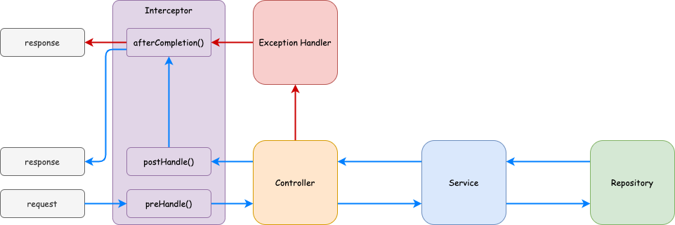

# Interceptor について

Interceptor とは Controller の前後に処理を挟みたい場合に使う。例えば認証の確認とかに使う。
|関数名|目的|
|---|---|
|`preHandle()`|Controller のメソッドが呼び出される前に処理を行いたい時。認証などに使う。|
|`postHandle()`|Controller のメソッドが正常に終了した後に処理を行いたいとき。ログなど。|
|`afterCompletion()`|リクエスト処理がが正常や異常に限らずとにかく終了した時。ログやクリーンアップなど。|



---

## Interceptor の実装

以下のように実装する。

1. HandlerInterceptor を継承したクラスの実装。

   ```java
   package com.example.springboot.interceptor;

   import jakarta.servlet.http.HttpServletRequest;
   import jakarta.servlet.http.HttpServletResponse;
   import org.slf4j.Logger;
   import org.slf4j.LoggerFactory;
   import org.springframework.stereotype.Component;
   import org.springframework.web.servlet.HandlerInterceptor;
   import org.springframework.web.servlet.ModelAndView;

   @Component
   public class MethodInterceptor implements HandlerInterceptor {

       private final Logger logger = LoggerFactory.getLogger(MethodInterceptor.class);

       @Override
       public boolean preHandle(HttpServletRequest request, HttpServletResponse response, Object handler) throws Exception {
           logger.info("{} にアクセスされました。", request.getRequestURI());
           return true;
       }

       @Override
       public void postHandle(HttpServletRequest request, HttpServletResponse response, Object handler, ModelAndView modelAndView) throws Exception {
           logger.info("{} でレスポンスしました。", response.getStatus());
       }
   }
   ```

   | 項目                  | 説明                                                                                                                                                                                         |
   | --------------------- | -------------------------------------------------------------------------------------------------------------------------------------------------------------------------------------------- |
   | `HttpServletRequest`  | クライアントからの HTTP リクエスト情報を表すインターフェース。URL、ヘッダー情報、クエリパラメータ、ポストデータ等のリクエスト情報にアクセスするメソッドを提供。                              |
   | `HttpServletResponse` | サーバーからの HTTP レスポンスをクライアントに送るためのインターフェース。ステータスコードの設定、ヘッダーの追加、レスポンスボディの書き出し等のレスポンスに関する操作を行うメソッドを提供。 |

1. Interceptor の登録

   Interceptor を作成した SpringMVC の設定に登録する必要がある。以下を実装する。

   ```java
   package com.example.springboot.config;

   import com.example.springboot.interceptor.MethodInterceptor;
   import org.springframework.beans.factory.annotation.Autowired;
   import org.springframework.context.annotation.Configuration;
   import org.springframework.web.servlet.config.annotation.InterceptorRegistry;
   import org.springframework.web.servlet.config.annotation.WebMvcConfigurer;

   @Configuration
   public class WebMvcConfig implements WebMvcConfigurer {

       @Autowired
       MethodInterceptor methodInterceptor;

       @Override
       public void addInterceptors(InterceptorRegistry registry) {
           registry.addInterceptor(methodInterceptor);
       }
   }
   ```

   WebMvcConfigurer の説明は次章で行う。

# 課題

テキストを参考にアクセスのあった URL とその結果をログに出力するようにせよ。
